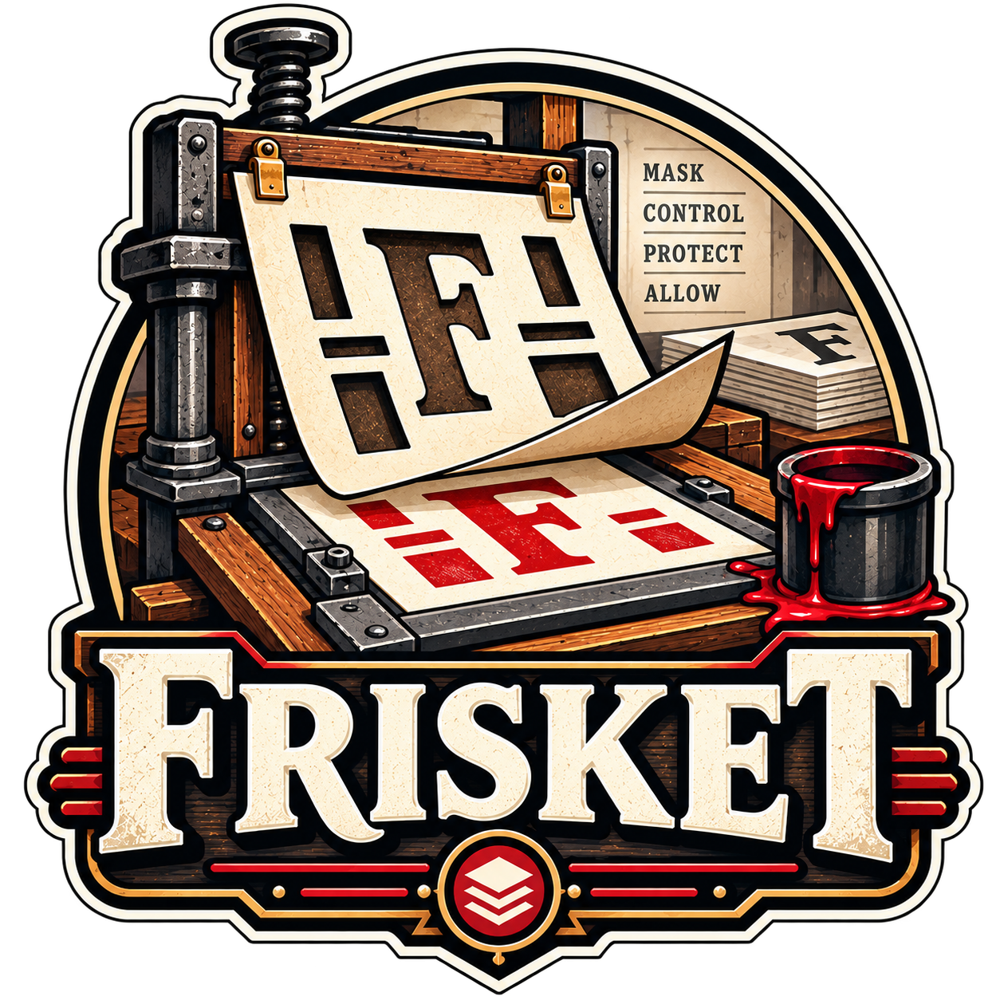

<p align="center"></p>

# frisket

> A *frisket* is the mask on a printing press that covers the parts of the sheet
> which must not take ink. [flong](https://github.com/danielbodart/flong) casts
> the plate; frisket decides what the sheet is allowed to take.

frisket keeps credentials out of sandboxes. It runs on the host, holds the
tokens, and adds them to requests on the wire, where the sandbox cannot reach
them. For a sandbox with no network of its own it is also the only way out,
and every connection and DNS query it sees is logged, one JSON line each.

Nothing in a sandbox is configured to use it. The kernel steers connections to
it with TPROXY: no proxy variables, no hosts file, no per-tool settings. The one
thing a sandbox is told is which CA to trust.

The design, what was measured and what was rejected are in
[PLAN.md](PLAN.md).

## Example

With [flong](https://github.com/danielbodart/flong), a policy and one line per
launcher:

```nix
{
  imports = [
    inputs.flong.nixosModules.default
    inputs.frisket.nixosModules.flong   # the daemon comes with it
  ];

  services.frisket = {
    user = "alice";                     # whose credentials it holds
    policies.research = {
      allow = [ "api.example.com" "*.pkg.example.org" ];
      intercept = [ "api.example.com" ];
      routes.example = {
        host = "api.example.com";
        upstream = "https://api.example.com";
        credentialFile = "/run/secrets/example-token";
        paths = [ { methods = [ "GET" "POST" ]; prefix = "/v1"; } ];
      };
    };
  };

  containers.agent.privateNetwork = true;
  flong.agent = { user = "alice"; command = ''set -- "$@"''; };

  services.frisket.flong.agent = {
    policy = "research";
    set = "all";                        # or "service", with flong's `network`
  };
}
```

A session `flong.agent` starts resolves `api.example.com` to frisket, which
terminates its TLS with the machine's CA, checks each request against the
route's paths, replaces whatever `Authorization` the sandbox sent with
`Bearer <token>` from the file, and forwards it upstream. `*.pkg.example.org`
resolves as usual and is spliced through untouched. Every other name is
refused at DNS, and every address frisket did not resolve for the session is
refused at connect — as are loopback, private ranges, link-local, CGNAT, ULA
and the host's own addresses, whatever resolved to them.

The CA is at `/etc/frisket/ca.crt` in every session, read-only. Telling each
runtime to trust it is yours to do, and each has its own way — Node's, for
one, adds it to the roots it already has:

```nix
flong.agent.command = ''
  export NODE_EXTRA_CA_CERTS=/etc/frisket/ca.crt
  set -- "$@"
'';
```

## Sets

- `all` — the sandbox has no network. All TCP and DNS go to frisket, other UDP
  is rejected, and frisket is the only way out.
- `service` — the sandbox has its own network (flong's `network`). Only DNS and
  frisket's service address, `192.0.2.2` and `2001:db8::2`, are steered;
  everything else goes direct. DNS is still held to the policy, so a policy
  that should resolve everything allows `*` and intercepts as usual:

  ```nix
  services.frisket.policies.trusted = {
    allow = [ "*" ];
    intercept = [ "api.example.com" ];
    routes.example = { /* as above */ };
  };
  ```

## Other launchers

Run as root, in this order, from a hook that has the sandbox's network
namespace before anything gives it egress:

```console
# frisket steer   -netns /proc/$leader/ns/net -steering $file -name $session -policy research
# frisket connect -netns /proc/$leader/ns/net -steering $file -name $session
# frisket close   -name $session
```

`$file` is `(frisket.lib.steering { set = "all"; }).json`: the ruleset and the
listener specification from one attrset. `frisket steering $file` prints what
it will do. `steer` creates the listeners inside the namespace and installs the
routing and the ruleset; `connect` gives the namespace its egress. Each refuses
to run out of turn.

## Options

| option | default | |
|---|---|---|
| `services.frisket.user` / `group` | `frisket` | who the daemon runs as: the owner of the credential files, never a DynamicUser |
| `services.frisket.policies.<name>.allow` | `[ ]` | names a session may resolve: `name`, `*.name` (any depth below it) or `*` (every name); a `*` anywhere else is refused |
| `services.frisket.policies.<name>.intercept` | `[ ]` | exact names answered with frisket's address; each must be allowed and have a route |
| `services.frisket.policies.<name>.routes.<route>` | `{ }` | `host`, `upstream`, `upstreamCA`, `credentialFile`, `header` (null: `Authorization: Bearer`), `strip`, `paths` |
| `services.frisket.dns` | host's `resolv.conf` | where frisket resolves allowed names |
| `services.frisket.caCertificate` | *read-only* | the CA certificate's path on the host |
| `services.frisket.controlSocket` | `/run/frisket/control.sock` | root-only; never bound into a sandbox |
| `services.frisket.maxSessions` | `256` | sizes the fd store that keeps sessions across a restart |
| `services.frisket.maxConnections` | built in | concurrent connections per session |
| `services.frisket.flong.<launcher>.policy` | *required* | the policy for the launcher's sessions |
| `services.frisket.flong.<launcher>.set` | `all` | `all` or `service` |
| `services.frisket.flong.<launcher>.params` | `{ }` | recorded with each session, for a policy that reads them; `workspace` always is |

A credential file is read by the daemon, as `user`, and re-read when replaced,
by rename too. The option is a string, so the file is never copied into the
store. Keep it out of `/tmp`, which the daemon cannot see.

## Development

```console
$ nix develop                        # go, gopls, golangci-lint
$ go test ./...
$ CGO_ENABLED=1 go test -race ./...  # the shell builds static, as the flake does
$ nix flake check                    # the build, the tests with and without -race,
                                     # gofmt, go vet, shellcheck, both rulesets
                                     # through nft, and the flong VM test
```

The tests make user and network namespaces with clone flags and skip where the
kernel refuses, so `nix flake check` runs inside the Nix sandbox. Logs are
asserted through an injected writer.

## Licence

MIT.
